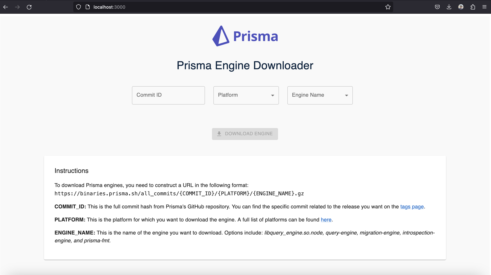

# Prisma Engine Downloader

Prisma Engine Downloader is a simple and user-friendly web application that allows users to generate URLs for downloading Prisma Engines. The application is built using React and Material-UI for a clean and modern user interface.

## Getting Started

These instructions will get you a copy of the project up and running on your local machine for development and testing purposes.

### Prerequisites

- Node.js
- npm

### Installation

1. Clone the repository

`git clone https://github.com/your-username/prisma-engine-downloader.git`

2. Install NPM packages

`npm install`

3. Start the development server

`npm start`

## Usage

To use the application, simply fill in the commit ID, platform, and engine name. The application will automatically generate a URL for downloading the Prisma Engine. Click the "Download Engine" button to open the generated URL in a new tab.

## Contributing

Contributions are what make the open source community such an amazing place to learn, inspire, and create. Any contributions you make are greatly appreciated.

1. Fork the Project
2. Create your Feature Branch (`git checkout -b feature/AmazingFeature`)
3. Commit your Changes (`git commit -m 'Add some AmazingFeature'`)
4. Push to the Branch (`git push origin feature/AmazingFeature`)
5. Open a Pull Request
